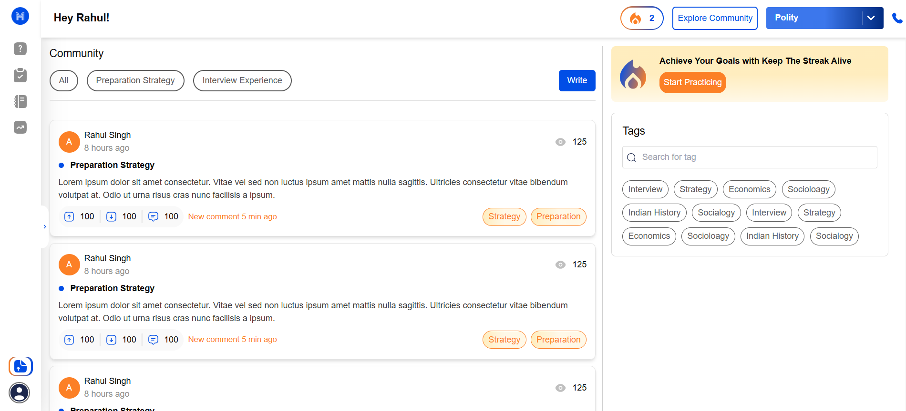
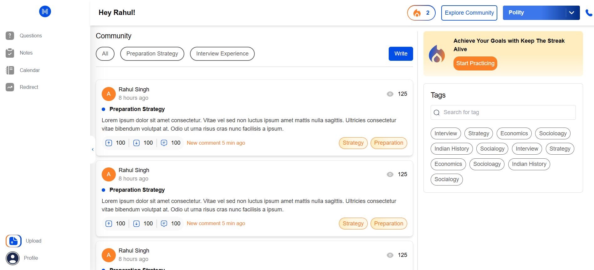
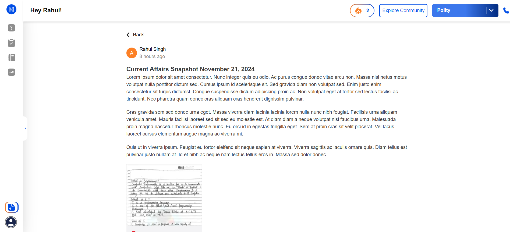
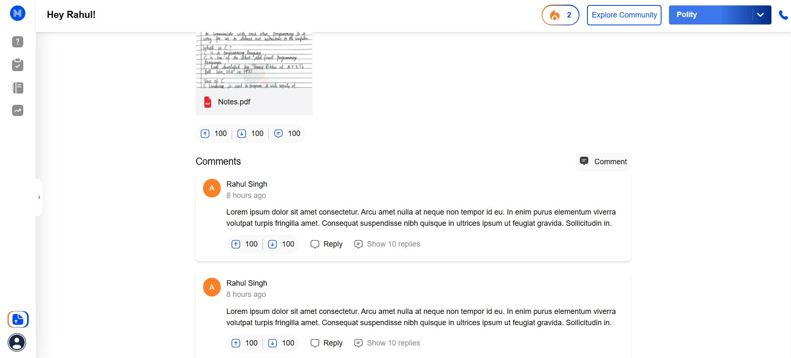
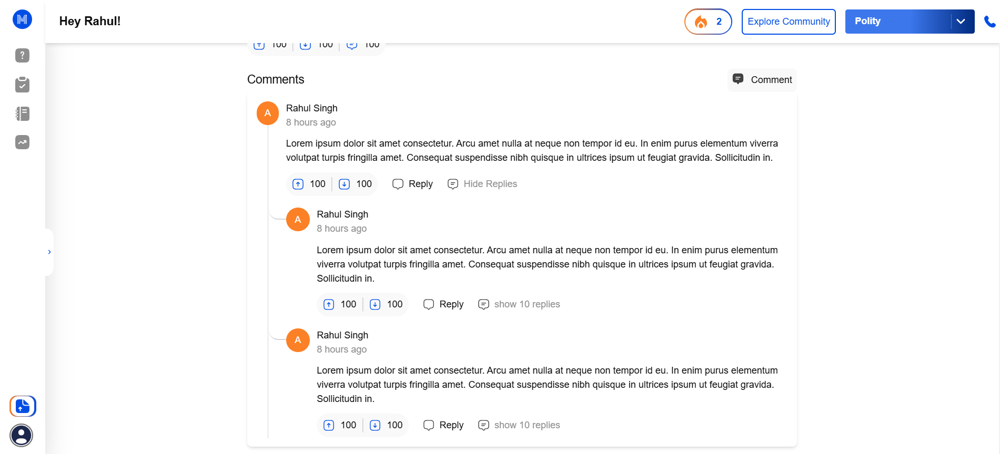

# **Mindgrade**

Mindgrade is a Next.js project designed for fast performance and a seamless user experience.

---

## **Installation**

Follow these steps to set up the project locally:

1. **Clone the repository:**
   ```bash
   git clone https://github.com/RohitGhosh7703/Mindgrade.git

2. **navigate to directory**
    cd Mindgrade

3. npm install

4. npm run dev


Available Routes
Home: http://localhost:3000
Community Post: http://localhost:3000/community/post/[postnumber]

Screenshots












